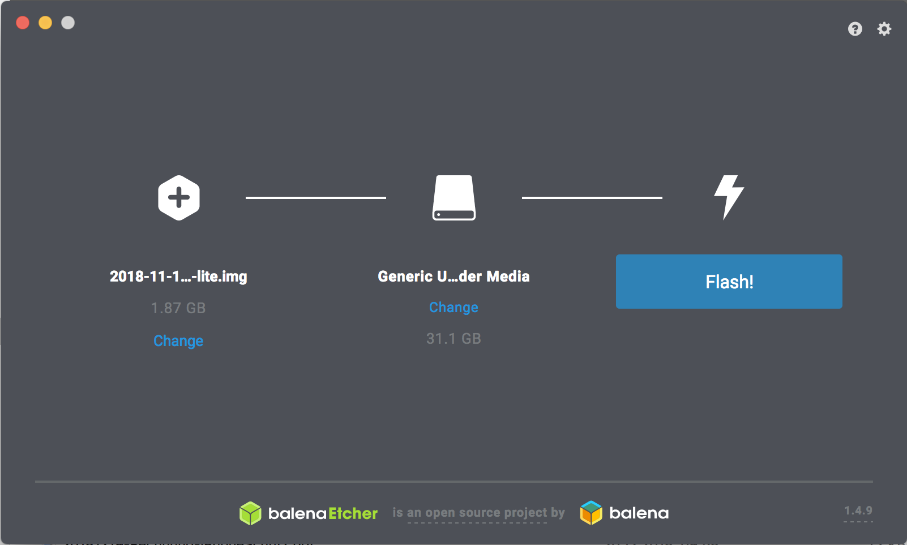
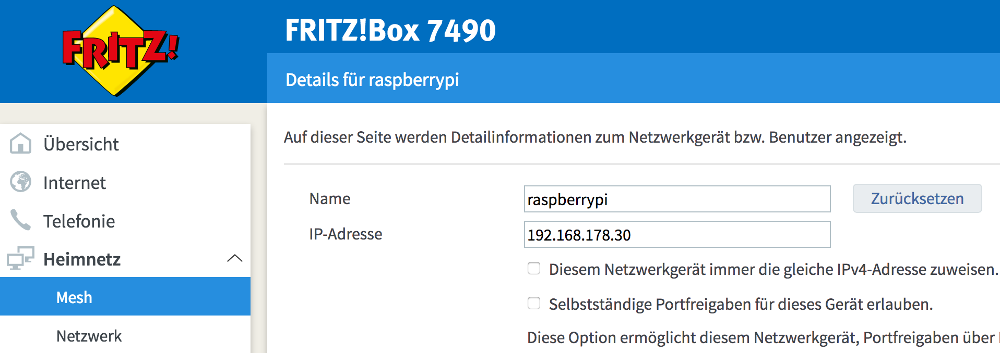

# raspberry-ansible
Setup a new Raspberry Pi 3 B+ with Ansible

I bought a new Raspberry Pi 3 B+ and as I love to automate things, I want to automate the setup as far as possible. This repo contains my notes, what I did - maybe it is of help to you.


### HowTo configure Raspberry headless

I want to use my Raspberry as a home server only - so no need for Desktops whatsoever. And it will only be connected via Ethernet - directly to my Router.

1. Download latest Raspbian Stretch Lite image from https://www.raspberrypi.org/downloads/raspbian/ (around 350MB) 

2. Unzip `2018-11-13-raspbian-stretch-lite.zip`, which will extract the image file `2018-11-13-raspbian-stretch-lite.img`

3. Connect the SD card to your Mac

4. Install Flash-Utility [etcher](https://www.balena.io/etcher/) (available for Mac, Win & Linux), e.g. with homebrew (see https://www.raspberrypi.org/documentation/installation/installing-images/README.md for more info)

```
brew cask install balenaetcher
```

5. Write the image to the SD card using Etcher



6. Remove and reconnect SD card to your Mac

7. Enable SSH on Raspberry by creating `ssh` file on the SD card inside `/boot` directory (because by default Raspbian disables sshd, we have to enable it):

```
touch /Volumes/boot/ssh
```

8. Find your Raspberry's IP at in your Router:



9. Try to connect to your Pi via SSH using `pi` user & password `raspberry`:

```
ssh pi@yourIpHere

# or without IP
ssh pi@raspberrypi.local
```

10. Initial configuration

Run `sudo raspi-config` to change the default password (__1 Change User Password__) and expand the file system, to make the entire space of SD card available (__7 Advanced Options / A1 Expand Filesystem__)


# Links

* https://medium.com/@viveks3th/how-to-bootstrap-a-headless-raspberry-pi-with-a-mac-6eba3be20b26
* https://github.com/yusekiya/raspi3_setup
* https://hackernoon.com/raspberry-pi-headless-install-462ccabd75d0